# GoPro Kamera & Udstyr Guide
Denne guide gennemgår hvad du skal være opmærksom på når du arbejder med DD Labbets GoPro kameraer samt dets udstyr.

## Kameraer

### To modeller:
* GoPro 3
* GoPro Hero 5 Black

## Udstyr
GoPro er kendt for at producere og udgive meget forskelligt udstyr til deres kameraer, og vi har i DD Labbet en bred vifte af udstyr tilgængeligt. Nedenfor kan du se en liste over hvad udstyret heder, hvad det bruges til, samt hvordan det ser ud. 

### Oversigt over GoPro Udstyr
| Navn        | Bruges til           | Billede  |
| ------------- |-------------| :-----:|
| Mounting Buckle | Bruges til at skrue GoProets Protective Housing eller Casing fast til, hvorefter den kan påsættes et mount. |    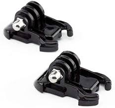 |
| Protective Housing      | Bruges til at sikre kameraet mod slag i ekstreme miljøer når du for eksempel står på ski eller svømmer under vandet. Vær opmærksom på at et Protective Housing reducerer kameraets evne til at optage lyd betydeligt. | 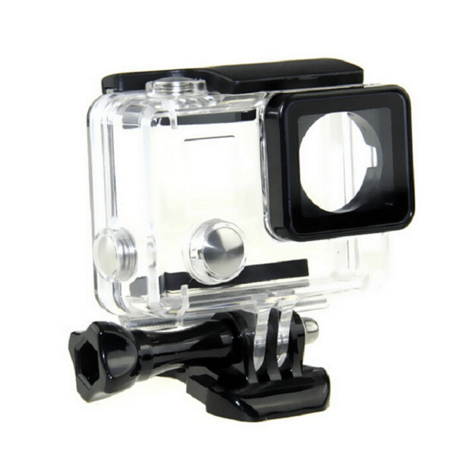 |
| Hero 5 Casing      | Bruges til at fastgøre DD Labbets GoPro Hero 5 til en Mounting Buckle og Mount. Dette casing kan kun bruges til DD Labbets GoPro Hero 5 model og er **IKKE** sikret mod slag og ekstreme miljøer, i modsætning til Protective Housing. | 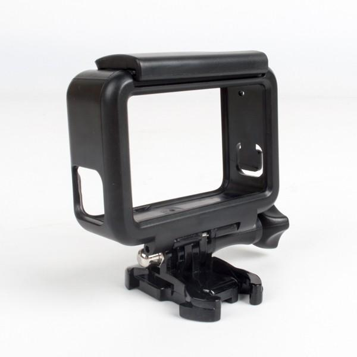 |
| 3-Way: Grib / Arm / Tripod | 3-I-En Stativ, håndtag og arm til at fastgøre et GoPro kamera på. Kan for eksempel bruges til at stille kameraet på et bord og optage derfra.  |    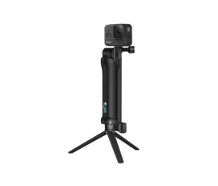 |
| Pivot Arm | Bruges til at du kan vinkle dit GoPro kamera fra dets mount, så du har flere muligheder for forskellige vinkler.  |    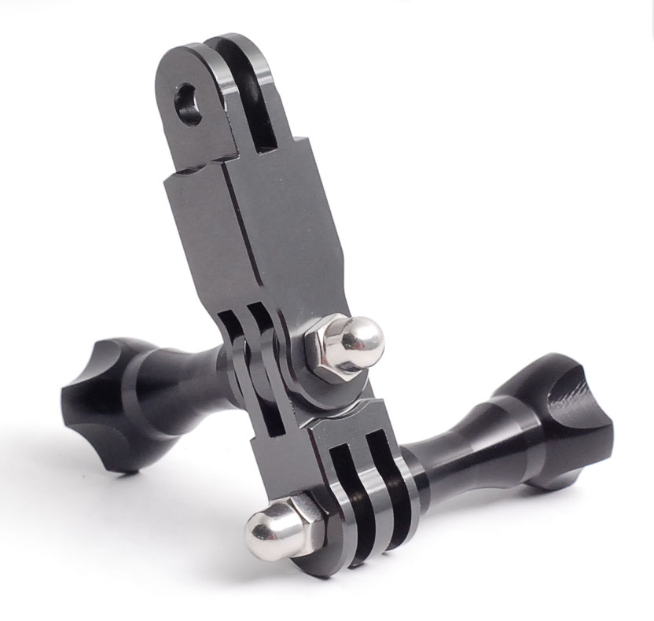 |
| Adhesive Mounts      | Bruges til at fastgøre GoPro kameraer på overflader. Disse har en klæbrig underside der gør den svær at fjerne efterfølgende. **Sæt derfor ikke et adhesive mount fast til en overflade hvor du ønsker at fjerne den efterfølgende. Derudover, så spørg altid en DD Lab ansat om du må bruge et adhesive mount i dit projekt** |   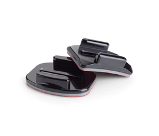 |
| Chest Mount | Bruges til at sætte GoPro kamera fast til brystet så du for eksempel kan optage dig selv eller en bruger i sit arbejde, uden du behøver at holde kameraet. |    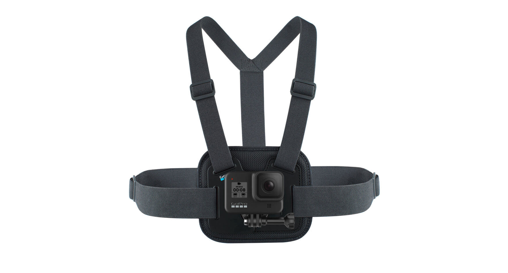 |
| Head Mount | Bruges til at sætte GoPro kamera fast på hovedet, så du kan optage hvad du eller en bruger kigger på, uden du behøver at holde kameraet aktivt. |    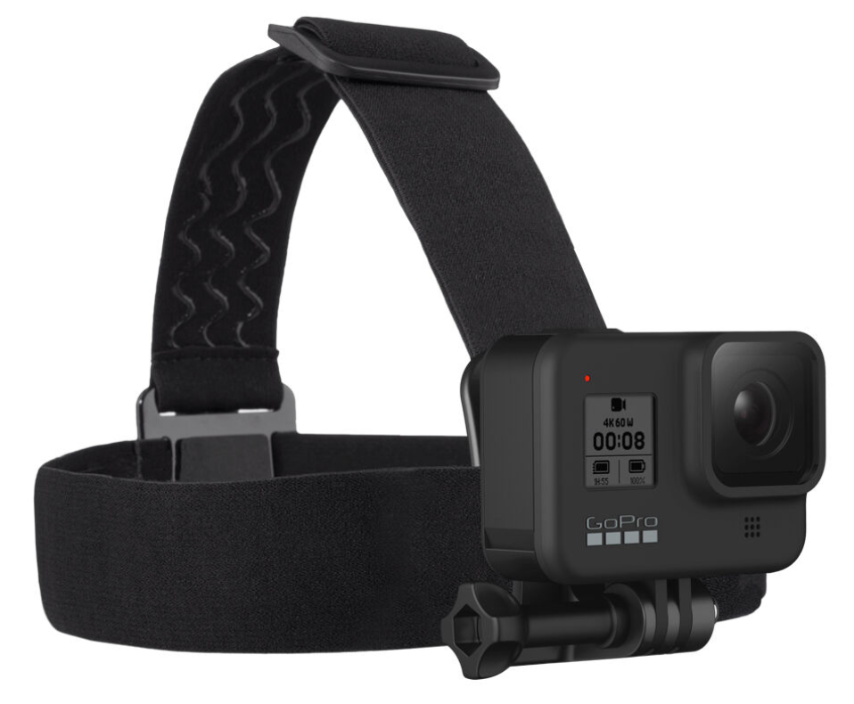 |
| Bite Mount | Bruges til at holde et GoPro kamera med munden, i situationer hvor du skal have hænderne fri og samtidig være i balance. Er designet til surfere. |    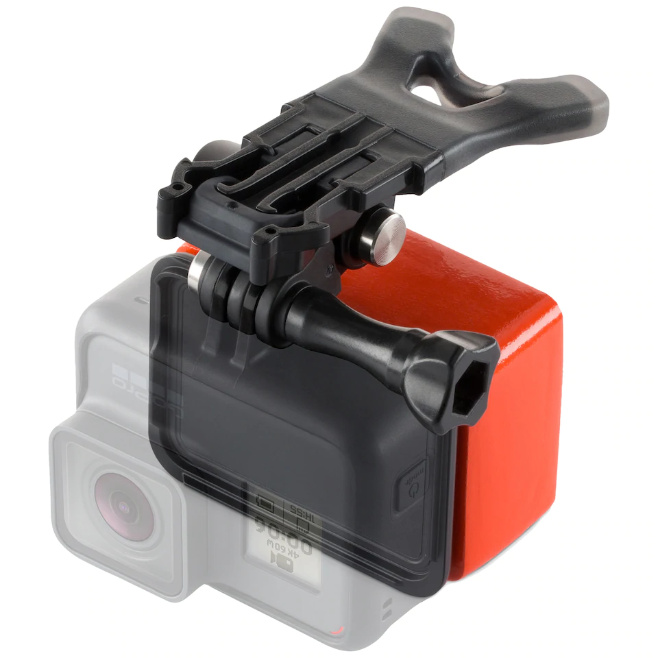 |
| Floaty | Kan fastgøres til et Bite Mount således at dit kamera flyder oven på vand, så det ikke synker til bunds. |    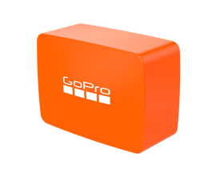 |
| Flex Clamp | Bruges til at fastgøre GoPro kameraet på en kant eller et greb. Kan for eksempel bruges til at fastsætte omkring en bordkant til en workshop eller om en gren i naturen.  |    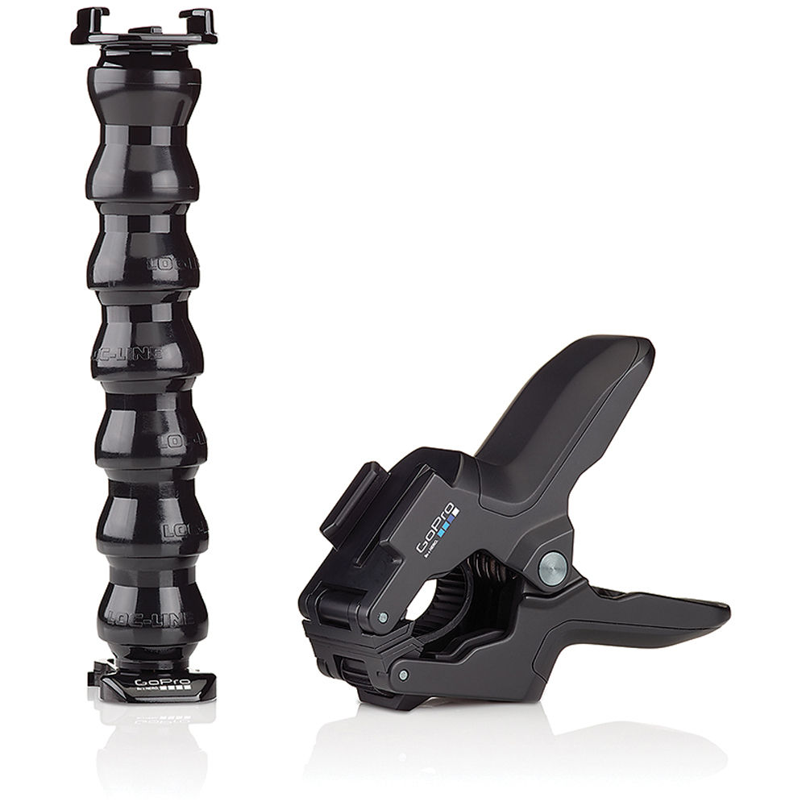 |
